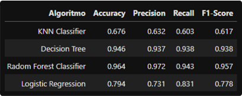

# Ensaio de Machine Learning

## Descrição
A Data Money considera o ajuste fino de algoritmos um fator essencial para o sucesso de suas consultorias. A expertise dos Cientistas de Dados na otimização dos modelos garante resultados mais eficazes para os clientes.

## Objetivo
O objetivo deste projeto é realizar testes com algoritmos de Classificação, Regressão e Clusterização para analisar como a variação dos principais parâmetros que influenciam o overfitting e o underfitting impacta a performance dos modelos.
# Planejamento da solução

## Produto final
O produto final será composto por sete tabelas que apresentarão a performance dos algoritmos, avaliados por múltiplas métricas, em três conjuntos de dados distintos: treinamento, validação e teste.

## Algoritmos ensaiados

### Classificação:
**Algoritmos:**
  - KNN
  - Decision Tree
  - Random Forest
  - Logistic Regression

**Métricas de performance:**
  - Accuracy
  - Precision
  - Recall
  - F1-Score

### Regressão:
**Algoritmos:** 
  - Decision Tree Regressor
  - Random Forest Regressor
  - Linear Regression
  - Linear Regression Lasso
  - Linear Regression Ridge
  - Linear Regression Elastic Net
  - Polinomial Regression
  - Polinomial Regression Lasso
  - Polinomial Regression Ridge
  - Polinomial Regression Elastic Net

**Métricas de performance:** 
  - R2
  - MSE
  - RMSE
  - MAE
  - MAPE

### Agrupamento:
**Algoritmos**: 
- K-Means
- Affinity Propagation

**Métricas de performance:**
- Silhouette Score

## Ferramentas utilizadas
Python 3.8 e Scikit-learn

# Desenvolvimento

## Estratégia da solução
Os ensaios com algoritmos de Machine Learning serão conduzidos por meio de códigos em Python, nos quais cada modelo será treinado com diferentes configurações de parâmetros. A performance será avaliada com base em métricas específicas, e os valores que resultarem no melhor desempenho serão escolhidos para o treinamento final do algoritmo.

## O passo a passo
**Passo 1**: Divisão dos dados em treino, teste e validação.

**Passo 2**: Treinamento dos algoritmos com os dados de treinamento, utilizando os parâmetros “default”.

**Passo 3**: Medir a performance dos algoritmos treinados com o parâmetro default, utilizando o conjunto de dados de treinamento.

**Passo 4**: Medir a performance dos algoritmos treinados com o parâmetro “default”, utilizando o conjunto de dados de validação.

**Passo 5**: Alternar os valores dos principais parâmetros que controlam o overfitting do algoritmo até encontrar o conjunto de parâmetros apresente a melhor performance dos algoritmos.

**Passo 6**: Unir os dados de treinamento e validação 

**Passo 7**: Retreinar o algoritmo com a união dos dados de treinamento evalidação, utilizando os melhores valores para os parâmetros de controledo algoritmo.

**Passo 8**: Medir a performance dos algoritmos treinados com os melhores parâmetro, utilizando o conjunto de dados de teste.

**Passo 9**: Avaliar os ensaios e anotar os 3 principais Insights que se destacaram.

# Os top 3 Insights
### Insight 1
Os algoritmos Decision Tree e Random Forest Classifier, ambos baseados em árvores de decisão, apresentaram o melhor desempenho em todas as três etapas do ensaio de classificação.
### Insight 2
Todos os algoritmos de regressão apresentaram um desempenho insatisfatório, evidenciando a necessidade de uma seleção mais criteriosa de atributos e uma preparação mais eficiente das variáveis independentes no conjunto de dados.
### Insight 3
Os algoritmos de clusterização apresentaram um desempenho insatisfatório, impossibilitando a formação de clusters bem definidos com os dados disponíveis no dataset.

# Resultados
## Ensaio de classificação:
### Sobre os dados de treinamento

### Sobre os dados de validação

### Sobre os dados de teste

## Ensaio de regressão:
### Sobre os dados de treinamento

### Sobre os dados de validação

### Sobre os dados de teste

## Ensaio de clusterização:

# Conclusão
Este ensaio proporcionou um entendimento mais aprofundado sobre o impacto dos hiperparâmetros na performance dos modelos, especialmente em relação ao equilíbrio entre overfitting e underfitting. Foi interessante observar como os algoritmos de árvores responderam à variação da profundidade, onde menores profundidades levaram ao underfitting, enquanto profundidades maiores resultaram em overfitting. Da mesma forma, nos modelos polinomiais, o grau do polinômio desempenhou um papel crucial na definição desse equilíbrio, influenciando diretamente a capacidade de generalização dos modelos.
Este ensaio de Machine Learning foi fundamental para aprofundar a compreensão sobre o funcionamento de diferentes algoritmos de classificação, regressão e clusterização, além de explorar os principais parâmetros que influenciam o equilíbrio entre underfitting e overfitting.

# Próximos passos
Com o conhecimento adquirido neste ensaio de Machine Learning, os próximos passos envolvem a aplicação desses conceitos na resolução de problemas de negócios reais e no desenvolvimento de projetos pessoais, explorando diferentes cenários e conjuntos de dados para aprofundar a compreensão sobre o desempenho dos algoritmos.
